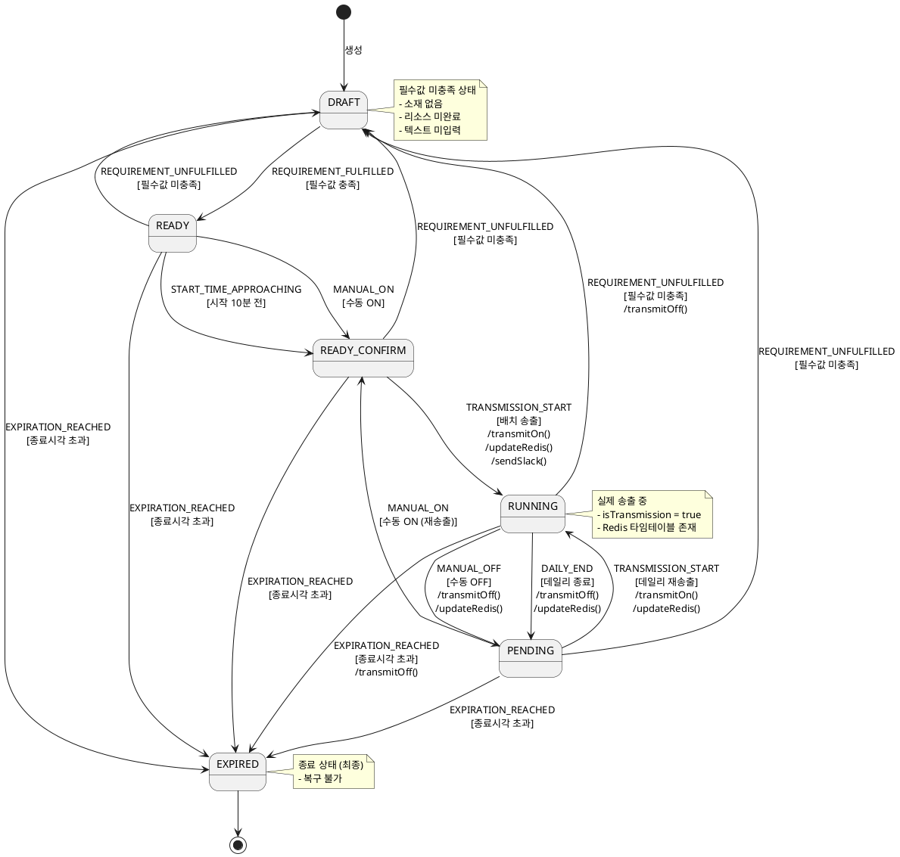

# Spring State Machine 프로젝트 도입 검토

> 본 문서는 티오더 광고 어드민 백엔드 프로젝트에 Spring State Machine(SSM) 부분 도입을 검토하기 위해 작성되었습니다.

---

## 목차

1. [기존 프로젝트 아키텍처](#1-기존-프로젝트-아키텍처)
2. [기존 프로젝트 문제점](#2-기존-프로젝트-문제점)
3. [Spring State Machine 도입 대상 도메인 및 개선 방안](#3-spring-state-machine-도입-대상-도메인-및-개선-방안)
4. [Spring State Machine 도입 예제](#4-spring-state-machine-도입-예제)

---

## 1. 기존 프로젝트 아키텍처

### 1.1 전체 아키텍처

```
┌─────────────────────────────────────────────────────────────────┐
│                    티오더 광고 어드민 백엔드                      │
├─────────────────────────────────────────────────────────────────┤
│                                                                 │
│  ┌───────────────────────────────────────────────────────────┐ │
│  │                    4-Tier Layered Architecture            │ │
│  │                                                           │ │
│  │   Controller → UseCase → Service → Repository            │ │
│  │                                                           │ │
│  └───────────────────────────────────────────────────────────┘ │
│                                                                 │
│  ┌───────────────────────────────────────────────────────────┐ │
│  │                    주요 도메인                             │ │
│  │                                                           │ │
│  │   ┌─────────┐  ┌─────────┐  ┌─────────┐  ┌─────────┐    │ │
│  │   │Campaign │  │ AdGroup │  │Creative │  │ Company │    │ │
│  │   │(캠페인) │  │(광고그룹)│  │ (소재)  │  │ (회사)  │    │ │
│  │   └─────────┘  └─────────┘  └─────────┘  └─────────┘    │ │
│  │                                                           │ │
│  └───────────────────────────────────────────────────────────┘ │
│                                                                 │
│  ┌───────────────────────────────────────────────────────────┐ │
│  │                    인프라스트럭처                          │ │
│  │                                                           │ │
│  │   MySQL (3 DB)    Redis    AWS S3/SQS    Keycloak       │ │
│  │                                                           │ │
│  └───────────────────────────────────────────────────────────┘ │
│                                                                 │
└─────────────────────────────────────────────────────────────────┘
```

### 1.2 상태 관리 대상 도메인

| 도메인 | 상태 Enum | 상태 수 | 특성 |
|--------|-----------|---------|------|
| **AdGroup** | `AdGroupStatus` | 7개 | DB 저장 + 계산 혼합 |
| **Campaign** | `CampaignStatus` | 7개 | 계산 상태 (하위 AdGroup 기반) |
| **Creative** | `CreativeStatus` | 4개 | 계산 상태 (리소스 기반) |
| **CreativeResource** | `ProcessingStatus` | 3개 | 단순 상태 |

### 1.3 AdGroup 상태 전이 흐름

```
┌─────────────────────────────────────────────────────────────────┐
│                    AdGroup 상태 전이 다이어그램                  │
└─────────────────────────────────────────────────────────────────┘

                          [필수값 미충족]
                               │
                               ↓
                        ┌──────────┐
               ┌───────→│  DRAFT   │←──────┐
               │        │ (작성중)  │       │
               │        └──────────┘       │
               │             │             │
               │     [필수값 충족]          │
               │             ↓             │
               │        ┌──────────┐       │
               │        │  READY   │       │
               │        │(준비완료) │       │
               │        └──────────┘       │
               │             │             │
               │  [시작 10분 전 또는 수동 ON] │
               │             ↓             │
               │        ┌──────────────┐   │
               │        │READY_CONFIRM │   │
               │        │  (준비확정)   │   │
               │        └──────────────┘   │
               │             │             │
               │        [배치 송출]         │
               │             ↓             │
        [필수값     ┌──────────┐           │
         미충족]    │ RUNNING  │←──────┐   │
               │   │  (송출중) │       │   │
               │   └──────────┘       │   │
               │        │    │        │   │
               │  [일시중지]  │   [재송출]  │
               │        │    │        │   │
               │        ↓    │        │   │
               │   ┌────────┐│        │   │
               └───│PENDING ││────────┘   │
                   │(일시중지)│            │
                   └────────┘             │
                        │                 │
                [종료시각 초과]             │
                        │                 │
                        ↓                 │
                   ┌──────────┐           │
                   │ EXPIRED  │───────────┘
                   │  (종료)   │  [필수값 미충족 시]
                   └──────────┘
```

### 1.4 현재 상태 관리 코드 구조

```
domain/ad/adgroup/
├── enums/
│   └── AdGroupStatus.java              # 상태 Enum
│
├── service/
│   ├── AdGroupService.java             # 상태 변경 메서드
│   └── impl/
│       └── AdGroupServiceImpl.java
│
├── usecase/
│   └── AdGroupUseCase.java             # 비즈니스 흐름 조율
│
└── utils/
    ├── AdGroupStatusCalculator.java    # 상태 계산 로직
    └── AdGroupTransmissionCandidateDecider.java  # 송출 대상 판정
```

### 1.5 상태 관리 관련 주요 컴포넌트

#### AdGroupStatus Enum

```java
public enum AdGroupStatus {
    UNKNOWN("미정의"),
    DRAFT("작성중"),
    READY("준비완료"),
    READY_CONFIRM("준비확정"),
    RUNNING("송출중"),
    PENDING("일시중지"),
    EXPIRED("종료");

    // 상태별 동작 메서드
    public boolean shouldCheckSlotMachineAvailability() {
        return this == READY || this == READY_CONFIRM
            || this == PENDING || this == RUNNING;
    }

    public boolean canDelete() {
        return this == DRAFT || this == READY || this == READY_CONFIRM;
    }
}
```

#### AdGroupStatusCalculator

```java
@Component
public class AdGroupStatusCalculator {

    public AdGroupStatus getStatus(AdGroupValidationDto dto) {
        LocalDateTime now = LocalDateTime.now();

        // 1단계: 종료 여부
        if (dto.getAdGroupEndAt().isBefore(now)) {
            return AdGroupStatus.EXPIRED;
        }

        // 2단계: 준비 완료 여부
        if (!isReady(dto)) {
            return AdGroupStatus.DRAFT;
        }

        // 3단계: 송출 중 여부
        if (dto.isRunningStatus()) {
            return AdGroupStatus.RUNNING;
        }

        // 4단계: 준비 확정 여부
        if (isReadyConfirmStatus(dto, now)) {
            return AdGroupStatus.READY_CONFIRM;
        }

        // 5단계: 일시 중지 여부
        if (dto.getTransmittedAt() != null) {
            return AdGroupStatus.PENDING;
        }

        return AdGroupStatus.READY;
    }

    private boolean isReady(AdGroupValidationDto dto) {
        return isRequiredFieldsFilled(dto)
            && isResourceValid(dto)
            && isTextValid(dto)
            && isTermsValid(dto);
    }
}
```

#### AdGroupTransmissionCandidateDecider

```java
@Component
public class AdGroupTransmissionCandidateDecider {

    // 종일 송출 시작 대상
    public boolean isFullTimeStartCandidate(AdGroup adGroup, LocalDateTime now) {
        return adGroup.isTransmissionCapable()
            && adGroup.getDailySchedule() == null
            && adGroup.getManualOnAt() == null
            && adGroup.getTransmittedAt() == null;
    }

    // 데일리 송출 시작 대상
    public boolean isDailyStartCandidate(AdGroup adGroup, LocalDateTime now) {
        return adGroup.isTransmissionCapable()
            && adGroup.getDailySchedule() != null
            && isDailyStartTimeReached(adGroup, now)
            && adGroup.getManualOffAt() == null;
    }

    // 데일리 송출 종료 대상
    public boolean isDailyEndCandidate(AdGroup adGroup, LocalDateTime now) {
        return adGroup.isTransmission()
            && adGroup.getDailySchedule() != null
            && isDailyEndTimeReached(adGroup, now);
    }

    // 수동 ON 송출 대상
    public boolean isManualOnCandidate(AdGroup adGroup, LocalDateTime now) {
        return adGroup.getManualOnAt() != null
            && adGroup.getManualOnAt().plusMinutes(10).isBefore(now)
            && !adGroup.isTransmission();
    }
}
```

#### AdGroup Entity 상태 변경 메서드

```java
@Entity
public class AdGroup extends BaseAllEntityAbstract {

    // 수동 ON
    public void manualOn(LocalDateTime now) {
        this.manualOnAt = now;
        this.manualOffAt = null;
    }

    // 수동 OFF
    public void manualOff(LocalDateTime now) {
        transmitOff();
        this.manualOnAt = null;
        this.manualOffAt = now;
    }

    // 송출 시작
    public void transmitOn(Integer order) {
        this.isTransmission = true;
        this.transmittedAt = LocalDateTime.now();
        this.order = order;
    }

    // 송출 중지
    public void transmitOff() {
        this.isTransmission = false;
        this.transmittingInventoryCount = 0;
    }

    // 만료 처리
    public void terminateExpiredAdGroup() {
        this.order = null;
        this.isTransmission = false;
    }
}
```

---

## 2. 기존 프로젝트 문제점

### 2.1 상태 전이 규칙의 분산

현재 상태 관리 로직이 여러 곳에 분산되어 있습니다.

```
┌─────────────────────────────────────────────────────────────────┐
│                    상태 관리 로직 분산 현황                      │
└─────────────────────────────────────────────────────────────────┘

  ┌─────────────────────┐
  │    AdGroupStatus    │  상태 정의 + 일부 검증 메서드
  │       (Enum)        │  - canDelete()
  │                     │  - shouldCheckSlotMachineAvailability()
  └─────────────────────┘
            │
            ↓
  ┌─────────────────────┐
  │ AdGroupStatusCalc   │  상태 계산 로직
  │    (Calculator)     │  - getStatus()
  │                     │  - isReady(), isReadyConfirm()
  └─────────────────────┘
            │
            ↓
  ┌─────────────────────┐
  │ AdGroupTransmission │  송출 대상 판정
  │  CandidateDecider   │  - isFullTimeStartCandidate()
  │                     │  - isDailyStartCandidate()
  │                     │  - isManualOnCandidate()
  └─────────────────────┘
            │
            ↓
  ┌─────────────────────┐
  │     AdGroup         │  상태 변경 메서드
  │     (Entity)        │  - manualOn(), manualOff()
  │                     │  - transmitOn(), transmitOff()
  └─────────────────────┘
            │
            ↓
  ┌─────────────────────┐
  │   AdGroupService    │  비즈니스 로직 + 외부 연동
  │     (Service)       │  - toggleTransmission()
  │                     │  - transmitSchedulableAdGroups()
  └─────────────────────┘

문제점:
├─ 상태 전이 규칙이 한눈에 파악되지 않음
├─ 변경 시 여러 파일 수정 필요
├─ 규칙 간 일관성 검증 어려움
└─ 테스트 시 모든 컴포넌트 이해 필요
```

### 2.2 복잡한 조건 분기

#### AdGroupStatusCalculator의 7단계 if-else 체인

```java
public AdGroupStatus getStatus(AdGroupValidationDto dto) {
    LocalDateTime now = LocalDateTime.now();

    // 1단계
    if (dto.getAdGroupEndAt().isBefore(now)) {
        return AdGroupStatus.EXPIRED;
    }

    // 2단계
    boolean ready = isReady(dto);
    if (!ready) {
        return AdGroupStatus.DRAFT;
    }

    // 3단계
    if (dto.isRunningStatus()) {
        return AdGroupStatus.RUNNING;
    }

    // 4단계
    if (isReadyConfirmStatus(dto, now)) {
        return AdGroupStatus.READY_CONFIRM;
    }

    // 5단계
    if (dto.getTransmittedAt() != null) {
        return AdGroupStatus.PENDING;
    }

    // 6단계
    return AdGroupStatus.READY;
}

// 추가로 isReady() 내부에 5단계 검증
private boolean isReady(AdGroupValidationDto dto) {
    return isRequiredFieldsFilled(dto)      // 1. 필수 필드
        && isResourceValid(dto)             // 2. 리소스 검증
        && isTextValid(dto)                 // 3. 텍스트 검증
        && isLinkValid(dto)                 // 4. 링크 검증
        && isTermsValid(dto);               // 5. 약관 검증
}
```

**문제점:**
- 조건문 순서가 중요하여 실수 가능성 높음
- 새로운 상태 추가 시 모든 조건 재검토 필요
- 상태 전이 규칙이 코드 흐름에 암시적으로 내포됨

### 2.3 외부 의존성 혼재

```java
// AdGroupService.transmitSchedulableAdGroups() 내 혼재된 외부 연동

public void transmitSchedulableAdGroups() {
    List<AdGroup> candidates = findTransmissionCandidates();

    for (AdGroup adGroup : candidates) {
        // 1. 상태 판정 (Decider)
        if (decider.isFullTimeStartCandidate(adGroup)) {
            // 2. 상태 변경 (Entity)
            adGroup.transmitOn(order);

            // 3. DB 저장 (Repository)
            repository.save(adGroup);

            // 4. Redis 갱신 (RedisService)
            redisService.saveTimetable(adGroup);

            // 5. Event API 호출 (EventApiService)
            eventApiService.sendTimetableSave(adGroup);

            // 6. Slack 알림 (SlackService)
            if (shouldNotify(adGroup)) {
                slackService.sendAlert(adGroup);
            }
        }
    }
}
```

**문제점:**
- 상태 전이와 부수 효과(Side Effect)가 혼재
- 부수 효과 실패 시 롤백 전략 불명확
- 단위 테스트 어려움

### 2.4 배치 의존적 상태 전이

```java
// 현재: 1시간 단위 배치로 상태 전이 처리
@Scheduled(cron = "0 0 * * * *")  // 매시 정각
public void processScheduledTransmissions() {
    // READY_CONFIRM → RUNNING 전이
    // 데일리 송출 시작/종료
    // 수동 ON 처리
}
```

**문제점:**
- 정확한 시점에 상태 전이 보장 불가 (최대 59분 지연)
- 배치 실패 시 상태 불일치 발생 가능
- 실시간 상태 조회 시 불일치 보완 로직 필요

### 2.5 상태 전이 이력 추적 어려움

```java
// 현재: 상태 변경 이력이 Hibernate Envers에 의존
// 문제: 누가, 왜, 어떤 조건으로 상태가 변경되었는지 추적 어려움

// 예시: campaign_aud 테이블
// | id | rev | revtype | status | modified_at |
// | 1  | 100 |    1    | RUNNING| 2024-01-01  |
//
// 질문: READY → RUNNING 전이가 왜 발생했는가?
// - 수동 ON인가?
// - 배치 자동 송출인가?
// - 어떤 조건이 충족되었는가?
// → Envers만으로는 알 수 없음
```

### 2.6 Campaign 상태 계산의 성능 이슈

```java
// Campaign 상태 조회 시마다 모든 AdGroup 상태 계산
public CampaignStatus getStatus(Campaign campaign) {
    List<AdGroup> adGroups = adGroupRepository.findByCampaignId(campaign.getId());

    // 각 AdGroup의 상태 계산 (O(n))
    List<AdGroupStatus> statuses = adGroups.stream()
        .map(adGroup -> statusCalculator.getStatus(toValidationDto(adGroup)))
        .toList();

    // Campaign 상태 계산
    return campaignStatusCalculator.calculateStatus(statuses, ...);
}
```

**문제점:**
- AdGroup 수가 많으면 조회 성능 저하
- 외부 API 호출(슬롯머신 검증)이 포함되면 더 심각
- 캐싱 전략 부재

### 2.7 문제점 요약 표

| 문제점 | 영향 | 심각도 |
|--------|------|:------:|
| 상태 전이 규칙 분산 | 유지보수 어려움, 버그 발생 가능성 | 높음 |
| 복잡한 조건 분기 | 가독성 저하, 변경 시 부작용 | 높음 |
| 외부 의존성 혼재 | 테스트 어려움, 롤백 전략 불명확 | 중간 |
| 배치 의존적 전이 | 정확성 저하, 실시간성 부족 | 중간 |
| 이력 추적 어려움 | 디버깅/감사 어려움 | 중간 |
| Campaign 상태 성능 | 조회 지연, 확장성 제한 | 낮음 |

---

## 3. Spring State Machine 도입 대상 도메인 및 개선 방안

### 3.1 도입 대상 도메인 선정

| 도메인 | SSM 적합성 | 판단 근거 |
|--------|:----------:|-----------|
| **AdGroup** | ✅ 적합 | 복잡한 상태 전이, 다수의 Guard/Action |
| Campaign | ❌ 부적합 | 계산 상태 (하위 AdGroup 상태 기반) |
| Creative | ❌ 부적합 | 단순 상태 (리소스 기반 계산) |

**결론: AdGroup 도메인에만 SSM 도입 권장**

### 3.2 AdGroup SSM 도입 시 개선 효과

#### Before vs After 비교

```
┌─────────────────────────────────────────────────────────────────┐
│                         BEFORE                                  │
├─────────────────────────────────────────────────────────────────┤
│                                                                 │
│  AdGroupStatus ─┬─ canDelete()                                 │
│       (Enum)    └─ shouldCheckSlotMachine()                    │
│                                                                 │
│  AdGroupStatusCalculator ─┬─ getStatus() [7단계 if-else]       │
│                           ├─ isReady() [5단계 검증]             │
│                           └─ isReadyConfirm()                  │
│                                                                 │
│  AdGroupTransmissionDecider ─┬─ isFullTimeStartCandidate()     │
│                              ├─ isDailyStartCandidate()        │
│                              ├─ isDailyEndCandidate()          │
│                              └─ isManualOnCandidate()          │
│                                                                 │
│  AdGroup (Entity) ─┬─ manualOn(), manualOff()                  │
│                    ├─ transmitOn(), transmitOff()              │
│                    └─ terminateExpiredAdGroup()                │
│                                                                 │
│  AdGroupService ─┬─ toggleTransmission()                       │
│                  ├─ transmitSchedulableAdGroups()              │
│                  └─ 외부 API 호출 로직                          │
│                                                                 │
└─────────────────────────────────────────────────────────────────┘

┌─────────────────────────────────────────────────────────────────┐
│                          AFTER                                  │
├─────────────────────────────────────────────────────────────────┤
│                                                                 │
│  AdGroupStateMachineConfig                                      │
│  ├─ States: DRAFT, READY, READY_CONFIRM, RUNNING, PENDING, ...│
│  ├─ Events: REQUIREMENT_MET, MANUAL_ON, START_TRANSMISSION, ...│
│  ├─ Transitions: 명시적 상태 전이 정의                          │
│  ├─ Guards: 전이 조건 (기존 Calculator/Decider 로직)            │
│  └─ Actions: 부수 효과 (Redis, Event API, Slack)               │
│                                                                 │
│  AdGroupService (간소화)                                        │
│  └─ stateMachine.sendEvent(event)                              │
│                                                                 │
└─────────────────────────────────────────────────────────────────┘
```

#### 개선 효과

| 항목 | Before | After |
|------|--------|-------|
| **상태 전이 규칙** | 4개 클래스에 분산 | 1개 Config에 집중 |
| **조건 분기** | 7단계 if-else | 선언적 Transition |
| **부수 효과** | Service에 혼재 | Action으로 분리 |
| **테스트** | 통합 테스트 필요 | 상태별 단위 테스트 가능 |
| **이력 추적** | Envers 의존 | Listener로 상세 기록 |

### 3.3 도입 전략

#### Phase 1: 준비 (1주)

```
1. SSM 의존성 추가
2. AdGroup 상태/이벤트 Enum 정의
3. 기본 StateMachineConfig 작성
4. 기존 로직과 병렬 실행 (검증용)
```

#### Phase 2: Guard/Action 이전 (2주)

```
1. Calculator/Decider 로직을 Guard로 이전
2. Entity 메서드 + 외부 연동을 Action으로 이전
3. Listener 구현 (로깅, 이력 기록)
4. 단위 테스트 작성
```

#### Phase 3: 통합 및 검증 (1주)

```
1. Service 레이어 SSM 적용
2. 기존 로직 제거
3. 통합 테스트 수행
4. 성능 검증
```

### 3.4 기존 로직과의 공존 구조

```
┌─────────────────────────────────────────────────────────────────┐
│                    도입 후 패키지 구조                           │
└─────────────────────────────────────────────────────────────────┘

domain/ad/adgroup/
├── controller/
│   └── AdGroupController.java
│
├── usecase/
│   └── AdGroupUseCase.java
│
├── service/
│   └── AdGroupService.java           # SSM 사용
│
├── statemachine/                      # [신규] SSM 패키지
│   ├── AdGroupStateMachineConfig.java # 상태 머신 설정
│   ├── AdGroupEvent.java              # 이벤트 Enum
│   ├── guards/                        # Guard 클래스들
│   │   ├── RequirementFulfilledGuard.java
│   │   ├── TransmissionCapableGuard.java
│   │   └── SlotMachineAvailableGuard.java
│   ├── actions/                       # Action 클래스들
│   │   ├── TransmitOnAction.java
│   │   ├── TransmitOffAction.java
│   │   ├── RedisUpdateAction.java
│   │   └── SlackNotifyAction.java
│   └── listeners/                     # Listener 클래스들
│       └── AdGroupStateMachineListener.java
│
├── repository/
│   └── AdGroupRepository.java
│
├── enums/
│   └── AdGroupStatus.java             # 기존 유지
│
└── utils/                             # [폐기 예정]
    ├── AdGroupStatusCalculator.java   # Guard로 이전
    └── AdGroupTransmissionCandidateDecider.java  # Guard로 이전
```

---

## 4. Spring State Machine 도입 예제

### 4.1 의존성 추가

```gradle
// build.gradle
dependencies {
    // Spring State Machine Core
    implementation 'org.springframework.statemachine:spring-statemachine-core:4.0.0'

    // Redis 영속화 (선택)
    implementation 'org.springframework.statemachine:spring-statemachine-data-redis:4.0.0'
}
```

### 4.2 이벤트 정의

```java
package com.torder.adadmin.domain.ad.adgroup.statemachine;

/**
 * AdGroup 상태 전이 이벤트
 */
public enum AdGroupEvent {

    // === 상태 계산 이벤트 ===

    /** 필수값 충족 (DRAFT → READY) */
    REQUIREMENT_FULFILLED,

    /** 필수값 미충족 (ANY → DRAFT) */
    REQUIREMENT_UNFULFILLED,

    // === 송출 관련 이벤트 ===

    /** 시작 10분 전 도래 (READY → READY_CONFIRM) */
    START_TIME_APPROACHING,

    /** 수동 ON (READY/PENDING → READY_CONFIRM) */
    MANUAL_ON,

    /** 배치 송출 시작 (READY_CONFIRM → RUNNING) */
    TRANSMISSION_START,

    /** 송출 중지 (RUNNING → PENDING) */
    TRANSMISSION_STOP,

    /** 수동 OFF (RUNNING → PENDING) */
    MANUAL_OFF,

    /** 데일리 송출 종료 (RUNNING → PENDING) */
    DAILY_END,

    // === 종료 이벤트 ===

    /** 종료 시각 초과 (ANY → EXPIRED) */
    EXPIRATION_REACHED,

    // === 검증 이벤트 ===

    /** 상태 재계산 요청 */
    RECALCULATE
}
```

### 4.3 StateMachine 설정

```java
package com.torder.adadmin.domain.ad.adgroup.statemachine;

import com.torder.adadmin.domain.ad.adgroup.enums.AdGroupStatus;
import com.torder.adadmin.domain.ad.adgroup.statemachine.actions.*;
import com.torder.adadmin.domain.ad.adgroup.statemachine.guards.*;
import lombok.RequiredArgsConstructor;
import org.springframework.context.annotation.Configuration;
import org.springframework.statemachine.config.EnableStateMachineFactory;
import org.springframework.statemachine.config.EnumStateMachineConfigurerAdapter;
import org.springframework.statemachine.config.builders.*;

import java.util.EnumSet;

/**
 * AdGroup 상태 머신 설정
 */
@Configuration
@EnableStateMachineFactory(name = "adGroupStateMachineFactory")
@RequiredArgsConstructor
public class AdGroupStateMachineConfig
        extends EnumStateMachineConfigurerAdapter<AdGroupStatus, AdGroupEvent> {

    // Guards
    private final RequirementFulfilledGuard requirementFulfilledGuard;
    private final TransmissionCapableGuard transmissionCapableGuard;
    private final ManualOnGuard manualOnGuard;
    private final ExpirationGuard expirationGuard;
    private final SlotMachineAvailableGuard slotMachineAvailableGuard;

    // Actions
    private final TransmitOnAction transmitOnAction;
    private final TransmitOffAction transmitOffAction;
    private final ManualOnAction manualOnAction;
    private final ManualOffAction manualOffAction;
    private final RedisUpdateAction redisUpdateAction;
    private final SlackNotifyAction slackNotifyAction;
    private final ErrorHandlerAction errorHandlerAction;

    // Listener
    private final AdGroupStateMachineListener stateMachineListener;

    @Override
    public void configure(StateMachineConfigurationConfigurer<AdGroupStatus, AdGroupEvent> config)
            throws Exception {
        config
            .withConfiguration()
            .machineId("adGroupStateMachine")
            .autoStartup(true)
            .listener(stateMachineListener);
    }

    @Override
    public void configure(StateMachineStateConfigurer<AdGroupStatus, AdGroupEvent> states)
            throws Exception {
        states
            .withStates()
            .initial(AdGroupStatus.DRAFT)
            .states(EnumSet.of(
                AdGroupStatus.DRAFT,
                AdGroupStatus.READY,
                AdGroupStatus.READY_CONFIRM,
                AdGroupStatus.RUNNING,
                AdGroupStatus.PENDING
            ))
            .end(AdGroupStatus.EXPIRED);
    }

    @Override
    public void configure(StateMachineTransitionConfigurer<AdGroupStatus, AdGroupEvent> transitions)
            throws Exception {

        // ========================================
        // DRAFT 상태에서의 전이
        // ========================================

        transitions
            // DRAFT → READY: 필수값 충족 시
            .withExternal()
                .source(AdGroupStatus.DRAFT)
                .target(AdGroupStatus.READY)
                .event(AdGroupEvent.REQUIREMENT_FULFILLED)
                .guard(requirementFulfilledGuard)
                .and()

            // DRAFT → EXPIRED: 종료 시각 초과 시
            .withExternal()
                .source(AdGroupStatus.DRAFT)
                .target(AdGroupStatus.EXPIRED)
                .event(AdGroupEvent.EXPIRATION_REACHED)
                .guard(expirationGuard)

        // ========================================
        // READY 상태에서의 전이
        // ========================================

            .and()
            // READY → DRAFT: 필수값 미충족 시
            .withExternal()
                .source(AdGroupStatus.READY)
                .target(AdGroupStatus.DRAFT)
                .event(AdGroupEvent.REQUIREMENT_UNFULFILLED)

            .and()
            // READY → READY_CONFIRM: 시작 10분 전 도래
            .withExternal()
                .source(AdGroupStatus.READY)
                .target(AdGroupStatus.READY_CONFIRM)
                .event(AdGroupEvent.START_TIME_APPROACHING)
                .guard(transmissionCapableGuard)

            .and()
            // READY → READY_CONFIRM: 수동 ON
            .withExternal()
                .source(AdGroupStatus.READY)
                .target(AdGroupStatus.READY_CONFIRM)
                .event(AdGroupEvent.MANUAL_ON)
                .guard(manualOnGuard)
                .action(manualOnAction, errorHandlerAction)

            .and()
            // READY → EXPIRED: 종료 시각 초과
            .withExternal()
                .source(AdGroupStatus.READY)
                .target(AdGroupStatus.EXPIRED)
                .event(AdGroupEvent.EXPIRATION_REACHED)
                .guard(expirationGuard)

        // ========================================
        // READY_CONFIRM 상태에서의 전이
        // ========================================

            .and()
            // READY_CONFIRM → DRAFT: 필수값 미충족 시
            .withExternal()
                .source(AdGroupStatus.READY_CONFIRM)
                .target(AdGroupStatus.DRAFT)
                .event(AdGroupEvent.REQUIREMENT_UNFULFILLED)

            .and()
            // READY_CONFIRM → RUNNING: 송출 시작 (배치)
            .withExternal()
                .source(AdGroupStatus.READY_CONFIRM)
                .target(AdGroupStatus.RUNNING)
                .event(AdGroupEvent.TRANSMISSION_START)
                .guard(slotMachineAvailableGuard)
                .action(transmitOnAction, errorHandlerAction)
                .action(redisUpdateAction)
                .action(slackNotifyAction)

            .and()
            // READY_CONFIRM → EXPIRED: 종료 시각 초과
            .withExternal()
                .source(AdGroupStatus.READY_CONFIRM)
                .target(AdGroupStatus.EXPIRED)
                .event(AdGroupEvent.EXPIRATION_REACHED)
                .guard(expirationGuard)

        // ========================================
        // RUNNING 상태에서의 전이
        // ========================================

            .and()
            // RUNNING → PENDING: 수동 OFF
            .withExternal()
                .source(AdGroupStatus.RUNNING)
                .target(AdGroupStatus.PENDING)
                .event(AdGroupEvent.MANUAL_OFF)
                .action(manualOffAction, errorHandlerAction)
                .action(transmitOffAction)
                .action(redisUpdateAction)

            .and()
            // RUNNING → PENDING: 데일리 송출 종료
            .withExternal()
                .source(AdGroupStatus.RUNNING)
                .target(AdGroupStatus.PENDING)
                .event(AdGroupEvent.DAILY_END)
                .action(transmitOffAction, errorHandlerAction)
                .action(redisUpdateAction)

            .and()
            // RUNNING → DRAFT: 필수값 미충족 (소재 삭제 등)
            .withExternal()
                .source(AdGroupStatus.RUNNING)
                .target(AdGroupStatus.DRAFT)
                .event(AdGroupEvent.REQUIREMENT_UNFULFILLED)
                .action(transmitOffAction)
                .action(redisUpdateAction)

            .and()
            // RUNNING → EXPIRED: 종료 시각 초과
            .withExternal()
                .source(AdGroupStatus.RUNNING)
                .target(AdGroupStatus.EXPIRED)
                .event(AdGroupEvent.EXPIRATION_REACHED)
                .guard(expirationGuard)
                .action(transmitOffAction)

        // ========================================
        // PENDING 상태에서의 전이
        // ========================================

            .and()
            // PENDING → DRAFT: 필수값 미충족
            .withExternal()
                .source(AdGroupStatus.PENDING)
                .target(AdGroupStatus.DRAFT)
                .event(AdGroupEvent.REQUIREMENT_UNFULFILLED)

            .and()
            // PENDING → READY_CONFIRM: 수동 ON (재송출)
            .withExternal()
                .source(AdGroupStatus.PENDING)
                .target(AdGroupStatus.READY_CONFIRM)
                .event(AdGroupEvent.MANUAL_ON)
                .guard(manualOnGuard)
                .action(manualOnAction, errorHandlerAction)

            .and()
            // PENDING → RUNNING: 데일리 송출 시작 (재송출)
            .withExternal()
                .source(AdGroupStatus.PENDING)
                .target(AdGroupStatus.RUNNING)
                .event(AdGroupEvent.TRANSMISSION_START)
                .guard(slotMachineAvailableGuard)
                .action(transmitOnAction, errorHandlerAction)
                .action(redisUpdateAction)

            .and()
            // PENDING → EXPIRED: 종료 시각 초과
            .withExternal()
                .source(AdGroupStatus.PENDING)
                .target(AdGroupStatus.EXPIRED)
                .event(AdGroupEvent.EXPIRATION_REACHED)
                .guard(expirationGuard);
    }
}
```

### 4.4 Guard 구현

#### RequirementFulfilledGuard (필수값 충족 검증)

```java
package com.torder.adadmin.domain.ad.adgroup.statemachine.guards;

import com.torder.adadmin.domain.ad.adgroup.enums.AdGroupStatus;
import com.torder.adadmin.domain.ad.adgroup.statemachine.AdGroupEvent;
import com.torder.adadmin.entity.ad.AdGroup;
import lombok.RequiredArgsConstructor;
import lombok.extern.slf4j.Slf4j;
import org.springframework.statemachine.StateContext;
import org.springframework.statemachine.guard.Guard;
import org.springframework.stereotype.Component;

/**
 * 광고그룹 필수값 충족 여부 검증 Guard
 *
 * 기존 AdGroupStatusCalculator.isReady() 로직을 Guard로 이전
 */
@Slf4j
@Component
@RequiredArgsConstructor
public class RequirementFulfilledGuard implements Guard<AdGroupStatus, AdGroupEvent> {

    @Override
    public boolean evaluate(StateContext<AdGroupStatus, AdGroupEvent> context) {
        AdGroup adGroup = getAdGroup(context);

        if (adGroup == null) {
            log.warn("AdGroup not found in context");
            return false;
        }

        boolean fulfilled = checkRequirements(adGroup);

        log.debug("RequirementFulfilledGuard evaluated: adGroupId={}, fulfilled={}",
            adGroup.getId(), fulfilled);

        return fulfilled;
    }

    private boolean checkRequirements(AdGroup adGroup) {
        // 1. 필수 필드 검증
        if (!isRequiredFieldsFilled(adGroup)) {
            return false;
        }

        // 2. 리소스 검증 (소재 타입별)
        if (!isResourceValid(adGroup)) {
            return false;
        }

        // 3. 텍스트 검증
        if (!isTextValid(adGroup)) {
            return false;
        }

        // 4. 링크 검증 (URL 형식)
        if (!isLinkValid(adGroup)) {
            return false;
        }

        // 5. 약관 검증 (참여형만)
        if (!isTermsValid(adGroup)) {
            return false;
        }

        return true;
    }

    private boolean isRequiredFieldsFilled(AdGroup adGroup) {
        return adGroup.getCompany() != null
            && adGroup.getName() != null && !adGroup.getName().isBlank()
            && adGroup.getStartAt() != null
            && adGroup.getEndAt() != null
            && adGroup.getCreative() != null;
    }

    private boolean isResourceValid(AdGroup adGroup) {
        // 소재 타입별 리소스 검증 로직
        // API 타입은 리소스 검증 제외
        if (adGroup.getCreative().getType().isApiType()) {
            return true;
        }

        // 필수 리소스 존재 + ProcessingStatus.SUCCESS 검증
        return adGroup.getCreative().getResources().stream()
            .filter(r -> r.isRequired())
            .allMatch(r -> r.getProcessingStatus().isSuccess());
    }

    private boolean isTextValid(AdGroup adGroup) {
        // 텍스트 리소스 검증 로직
        return adGroup.getCreative().getTextResources().stream()
            .filter(t -> t.isRequired())
            .allMatch(t -> t.getData() != null && !t.getData().isBlank());
    }

    private boolean isLinkValid(AdGroup adGroup) {
        // 트래킹 링크 URL 형식 검증
        var trackingLink = adGroup.getCreative().getTextResources().stream()
            .filter(t -> t.getType().isTrackingLink())
            .findFirst();

        if (trackingLink.isEmpty()) {
            return true;
        }

        String url = trackingLink.get().getData();
        return url != null && (url.startsWith("http://") || url.startsWith("https://"));
    }

    private boolean isTermsValid(AdGroup adGroup) {
        // 참여형 소재는 약관 필수
        if (!adGroup.getCreative().getType().isParticipationType()) {
            return true;
        }

        return !adGroup.getCreative().getTerms().isEmpty();
    }

    private AdGroup getAdGroup(StateContext<AdGroupStatus, AdGroupEvent> context) {
        return (AdGroup) context.getExtendedState().getVariables().get("adGroup");
    }
}
```

#### TransmissionCapableGuard (송출 가능 검증)

```java
package com.torder.adadmin.domain.ad.adgroup.statemachine.guards;

import com.torder.adadmin.domain.ad.adgroup.enums.AdGroupStatus;
import com.torder.adadmin.domain.ad.adgroup.statemachine.AdGroupEvent;
import com.torder.adadmin.entity.ad.AdGroup;
import lombok.extern.slf4j.Slf4j;
import org.springframework.statemachine.StateContext;
import org.springframework.statemachine.guard.Guard;
import org.springframework.stereotype.Component;

import java.time.LocalDateTime;

/**
 * 송출 가능 여부 검증 Guard
 *
 * 기존 AdGroupTransmissionCandidateDecider 로직의 일부
 */
@Slf4j
@Component
public class TransmissionCapableGuard implements Guard<AdGroupStatus, AdGroupEvent> {

    @Override
    public boolean evaluate(StateContext<AdGroupStatus, AdGroupEvent> context) {
        AdGroup adGroup = getAdGroup(context);
        LocalDateTime now = LocalDateTime.now();

        if (adGroup == null) {
            return false;
        }

        // 종료 시각 체크
        if (adGroup.getEndAt().isBefore(now)) {
            log.debug("AdGroup expired: adGroupId={}", adGroup.getId());
            return false;
        }

        // 시작 시각 10분 전 체크
        LocalDateTime tenMinutesBefore = adGroup.getStartAt().minusMinutes(10);
        if (now.isBefore(tenMinutesBefore)) {
            log.debug("AdGroup start time not approaching: adGroupId={}", adGroup.getId());
            return false;
        }

        // 이미 송출 중인 경우 제외
        if (adGroup.isTransmission()) {
            log.debug("AdGroup already transmitting: adGroupId={}", adGroup.getId());
            return false;
        }

        return true;
    }

    private AdGroup getAdGroup(StateContext<AdGroupStatus, AdGroupEvent> context) {
        return (AdGroup) context.getExtendedState().getVariables().get("adGroup");
    }
}
```

#### SlotMachineAvailableGuard (슬롯머신 검증)

```java
package com.torder.adadmin.domain.ad.adgroup.statemachine.guards;

import com.torder.adadmin.domain.ad.adgroup.enums.AdGroupStatus;
import com.torder.adadmin.domain.ad.adgroup.statemachine.AdGroupEvent;
import com.torder.adadmin.domain.ad.events.service.EventApiService;
import com.torder.adadmin.entity.ad.AdGroup;
import lombok.RequiredArgsConstructor;
import lombok.extern.slf4j.Slf4j;
import org.springframework.statemachine.StateContext;
import org.springframework.statemachine.guard.Guard;
import org.springframework.stereotype.Component;

/**
 * 슬롯머신 소재 가용성 검증 Guard
 *
 * 슬롯머신 타입 소재의 경우 Event API로 가용성 검증 필요
 */
@Slf4j
@Component
@RequiredArgsConstructor
public class SlotMachineAvailableGuard implements Guard<AdGroupStatus, AdGroupEvent> {

    private final EventApiService eventApiService;

    @Override
    public boolean evaluate(StateContext<AdGroupStatus, AdGroupEvent> context) {
        AdGroup adGroup = getAdGroup(context);

        if (adGroup == null) {
            return false;
        }

        // 슬롯머신 타입이 아니면 검증 통과
        if (!adGroup.getCreative().getType().isSlotMachine()) {
            return true;
        }

        try {
            boolean available = eventApiService.checkSlotMachineAvailability(
                adGroup.getCreative().getId()
            );

            log.debug("SlotMachine availability check: adGroupId={}, available={}",
                adGroup.getId(), available);

            return available;
        } catch (Exception e) {
            log.error("Failed to check slot machine availability: adGroupId={}",
                adGroup.getId(), e);
            return false;
        }
    }

    private AdGroup getAdGroup(StateContext<AdGroupStatus, AdGroupEvent> context) {
        return (AdGroup) context.getExtendedState().getVariables().get("adGroup");
    }
}
```

### 4.5 Action 구현

#### TransmitOnAction (송출 시작)

```java
package com.torder.adadmin.domain.ad.adgroup.statemachine.actions;

import com.torder.adadmin.domain.ad.adgroup.enums.AdGroupStatus;
import com.torder.adadmin.domain.ad.adgroup.statemachine.AdGroupEvent;
import com.torder.adadmin.domain.ad.adgroup.service.AdGroupOrderService;
import com.torder.adadmin.entity.ad.AdGroup;
import lombok.RequiredArgsConstructor;
import lombok.extern.slf4j.Slf4j;
import org.springframework.statemachine.StateContext;
import org.springframework.statemachine.action.Action;
import org.springframework.stereotype.Component;

/**
 * 송출 시작 Action
 *
 * AdGroup.transmitOn() 호출 + 순서 부여
 */
@Slf4j
@Component
@RequiredArgsConstructor
public class TransmitOnAction implements Action<AdGroupStatus, AdGroupEvent> {

    private final AdGroupOrderService orderService;

    @Override
    public void execute(StateContext<AdGroupStatus, AdGroupEvent> context) {
        AdGroup adGroup = getAdGroup(context);

        if (adGroup == null) {
            log.error("AdGroup not found in context for TransmitOnAction");
            return;
        }

        try {
            // 송출 순서 계산
            Integer order = orderService.calculateNextOrder(adGroup.getCampaign().getId());

            // 송출 시작 처리
            adGroup.transmitOn(order);

            log.info("Transmission started: adGroupId={}, order={}", adGroup.getId(), order);

            // 컨텍스트에 결과 저장 (후속 Action에서 사용)
            context.getExtendedState().getVariables().put("transmissionOrder", order);

        } catch (Exception e) {
            log.error("Failed to start transmission: adGroupId={}", adGroup.getId(), e);
            context.getStateMachine().setStateMachineError(e);
        }
    }

    private AdGroup getAdGroup(StateContext<AdGroupStatus, AdGroupEvent> context) {
        return (AdGroup) context.getExtendedState().getVariables().get("adGroup");
    }
}
```

#### RedisUpdateAction (Redis 갱신)

```java
package com.torder.adadmin.domain.ad.adgroup.statemachine.actions;

import com.torder.adadmin.common.utils.redis.RedisService;
import com.torder.adadmin.domain.ad.adgroup.enums.AdGroupStatus;
import com.torder.adadmin.domain.ad.adgroup.statemachine.AdGroupEvent;
import com.torder.adadmin.domain.ad.events.service.EventApiService;
import com.torder.adadmin.entity.ad.AdGroup;
import lombok.RequiredArgsConstructor;
import lombok.extern.slf4j.Slf4j;
import org.springframework.statemachine.StateContext;
import org.springframework.statemachine.action.Action;
import org.springframework.stereotype.Component;

/**
 * Redis 타임테이블 갱신 Action
 *
 * 상태 전이 후 Redis에 송출 정보 반영
 */
@Slf4j
@Component
@RequiredArgsConstructor
public class RedisUpdateAction implements Action<AdGroupStatus, AdGroupEvent> {

    private final RedisService redisService;
    private final EventApiService eventApiService;

    @Override
    public void execute(StateContext<AdGroupStatus, AdGroupEvent> context) {
        AdGroup adGroup = getAdGroup(context);
        AdGroupStatus targetStatus = context.getTarget().getId();

        if (adGroup == null) {
            log.error("AdGroup not found in context for RedisUpdateAction");
            return;
        }

        try {
            switch (targetStatus) {
                case RUNNING -> handleTransmissionStart(adGroup);
                case PENDING, DRAFT, EXPIRED -> handleTransmissionStop(adGroup);
                default -> log.debug("No Redis update needed for status: {}", targetStatus);
            }
        } catch (Exception e) {
            log.error("Failed to update Redis: adGroupId={}, status={}",
                adGroup.getId(), targetStatus, e);
            // Redis 갱신 실패는 상태 전이 롤백하지 않음 (비동기 재시도 가능)
        }
    }

    private void handleTransmissionStart(AdGroup adGroup) {
        // Event API로 타임테이블 저장 요청
        eventApiService.sendTimetableSave(adGroup);

        log.info("Redis timetable saved: adGroupId={}", adGroup.getId());
    }

    private void handleTransmissionStop(AdGroup adGroup) {
        // Event API로 타임테이블 삭제 요청
        eventApiService.sendTimetableDelete(adGroup);

        log.info("Redis timetable deleted: adGroupId={}", adGroup.getId());
    }

    private AdGroup getAdGroup(StateContext<AdGroupStatus, AdGroupEvent> context) {
        return (AdGroup) context.getExtendedState().getVariables().get("adGroup");
    }
}
```

#### SlackNotifyAction (Slack 알림)

```java
package com.torder.adadmin.domain.ad.adgroup.statemachine.actions;

import com.torder.adadmin.common.utils.slack.SlackMessageService;
import com.torder.adadmin.domain.ad.adgroup.enums.AdGroupStatus;
import com.torder.adadmin.domain.ad.adgroup.statemachine.AdGroupEvent;
import com.torder.adadmin.entity.ad.AdGroup;
import lombok.RequiredArgsConstructor;
import lombok.extern.slf4j.Slf4j;
import org.springframework.statemachine.StateContext;
import org.springframework.statemachine.action.Action;
import org.springframework.stereotype.Component;

import java.time.LocalDate;

/**
 * Slack 알림 Action
 *
 * 정예정(당일 송출 예정) 광고그룹 알림
 */
@Slf4j
@Component
@RequiredArgsConstructor
public class SlackNotifyAction implements Action<AdGroupStatus, AdGroupEvent> {

    private final SlackMessageService slackMessageService;

    @Override
    public void execute(StateContext<AdGroupStatus, AdGroupEvent> context) {
        AdGroup adGroup = getAdGroup(context);

        if (adGroup == null) {
            return;
        }

        // 당일 송출 예정인 경우만 알림
        if (!isScheduledForToday(adGroup)) {
            return;
        }

        try {
            slackMessageService.sendScheduledTransmissionAlert(
                adGroup.getName(),
                adGroup.getCampaign().getName(),
                adGroup.getStartAt()
            );

            log.info("Slack notification sent: adGroupId={}", adGroup.getId());
        } catch (Exception e) {
            log.warn("Failed to send Slack notification: adGroupId={}", adGroup.getId(), e);
            // Slack 알림 실패는 상태 전이에 영향 없음
        }
    }

    private boolean isScheduledForToday(AdGroup adGroup) {
        return adGroup.getStartAt().toLocalDate().equals(LocalDate.now());
    }

    private AdGroup getAdGroup(StateContext<AdGroupStatus, AdGroupEvent> context) {
        return (AdGroup) context.getExtendedState().getVariables().get("adGroup");
    }
}
```

#### ErrorHandlerAction (에러 처리)

```java
package com.torder.adadmin.domain.ad.adgroup.statemachine.actions;

import com.torder.adadmin.domain.ad.adgroup.enums.AdGroupStatus;
import com.torder.adadmin.domain.ad.adgroup.statemachine.AdGroupEvent;
import com.torder.adadmin.entity.ad.AdGroup;
import lombok.extern.slf4j.Slf4j;
import org.springframework.statemachine.StateContext;
import org.springframework.statemachine.action.Action;
import org.springframework.stereotype.Component;

/**
 * 상태 전이 에러 처리 Action
 */
@Slf4j
@Component
public class ErrorHandlerAction implements Action<AdGroupStatus, AdGroupEvent> {

    @Override
    public void execute(StateContext<AdGroupStatus, AdGroupEvent> context) {
        Exception exception = context.getException();
        AdGroup adGroup = getAdGroup(context);

        String adGroupId = adGroup != null ? adGroup.getId() : "unknown";
        AdGroupStatus sourceStatus = context.getSource() != null
            ? context.getSource().getId() : null;
        AdGroupStatus targetStatus = context.getTarget() != null
            ? context.getTarget().getId() : null;

        log.error("State transition error: adGroupId={}, from={}, to={}, error={}",
            adGroupId, sourceStatus, targetStatus,
            exception != null ? exception.getMessage() : "unknown");

        // 에러 컨텍스트에 기록 (후속 처리용)
        context.getExtendedState().getVariables().put("lastError", exception);
        context.getExtendedState().getVariables().put("errorTimestamp", System.currentTimeMillis());
    }

    private AdGroup getAdGroup(StateContext<AdGroupStatus, AdGroupEvent> context) {
        return (AdGroup) context.getExtendedState().getVariables().get("adGroup");
    }
}
```

### 4.6 Listener 구현

```java
package com.torder.adadmin.domain.ad.adgroup.statemachine.listeners;

import com.torder.adadmin.domain.ad.adgroup.enums.AdGroupStatus;
import com.torder.adadmin.domain.ad.adgroup.statemachine.AdGroupEvent;
import com.torder.adadmin.entity.ad.AdGroup;
import lombok.RequiredArgsConstructor;
import lombok.extern.slf4j.Slf4j;
import org.springframework.statemachine.StateContext;
import org.springframework.statemachine.StateMachine;
import org.springframework.statemachine.listener.StateMachineListenerAdapter;
import org.springframework.statemachine.state.State;
import org.springframework.statemachine.transition.Transition;
import org.springframework.stereotype.Component;

import java.time.LocalDateTime;

/**
 * AdGroup 상태 머신 리스너
 *
 * 상태 전이 이력 기록 및 모니터링
 */
@Slf4j
@Component
@RequiredArgsConstructor
public class AdGroupStateMachineListener
        extends StateMachineListenerAdapter<AdGroupStatus, AdGroupEvent> {

    private final AdGroupTransitionHistoryRepository historyRepository;

    @Override
    public void stateChanged(State<AdGroupStatus, AdGroupEvent> from,
                            State<AdGroupStatus, AdGroupEvent> to) {
        AdGroupStatus fromStatus = from != null ? from.getId() : null;
        AdGroupStatus toStatus = to.getId();

        log.info("AdGroup state changed: {} -> {}", fromStatus, toStatus);
    }

    @Override
    public void transitionStarted(Transition<AdGroupStatus, AdGroupEvent> transition) {
        log.debug("Transition started: {} -> {} [event: {}]",
            transition.getSource().getId(),
            transition.getTarget().getId(),
            transition.getTrigger().getEvent());
    }

    @Override
    public void transitionEnded(Transition<AdGroupStatus, AdGroupEvent> transition) {
        log.debug("Transition ended: {} -> {}",
            transition.getSource().getId(),
            transition.getTarget().getId());
    }

    @Override
    public void stateContext(StateContext<AdGroupStatus, AdGroupEvent> stateContext) {
        // 상태 전이 완료 후 이력 저장
        if (stateContext.getStage() == StateContext.Stage.TRANSITION_END) {
            saveTransitionHistory(stateContext);
        }
    }

    @Override
    public void eventNotAccepted(org.springframework.messaging.Message<AdGroupEvent> event) {
        log.warn("Event not accepted: {}", event.getPayload());
    }

    @Override
    public void stateMachineError(StateMachine<AdGroupStatus, AdGroupEvent> stateMachine,
                                  Exception exception) {
        log.error("State machine error", exception);
    }

    private void saveTransitionHistory(StateContext<AdGroupStatus, AdGroupEvent> context) {
        try {
            AdGroup adGroup = (AdGroup) context.getExtendedState()
                .getVariables().get("adGroup");

            if (adGroup == null) {
                return;
            }

            AdGroupStatus fromStatus = context.getSource() != null
                ? context.getSource().getId() : null;
            AdGroupStatus toStatus = context.getTarget().getId();
            AdGroupEvent event = context.getEvent();

            // 전이 이력 저장
            AdGroupTransitionHistory history = AdGroupTransitionHistory.builder()
                .adGroupId(adGroup.getId())
                .fromStatus(fromStatus)
                .toStatus(toStatus)
                .event(event)
                .transitionAt(LocalDateTime.now())
                .build();

            historyRepository.save(history);

            log.debug("Transition history saved: adGroupId={}, {} -> {} [{}]",
                adGroup.getId(), fromStatus, toStatus, event);

        } catch (Exception e) {
            log.warn("Failed to save transition history", e);
        }
    }
}
```

### 4.7 Service 적용

```java
package com.torder.adadmin.domain.ad.adgroup.service.impl;

import com.torder.adadmin.domain.ad.adgroup.enums.AdGroupStatus;
import com.torder.adadmin.domain.ad.adgroup.repository.AdGroupRepository;
import com.torder.adadmin.domain.ad.adgroup.service.AdGroupService;
import com.torder.adadmin.domain.ad.adgroup.statemachine.AdGroupEvent;
import com.torder.adadmin.entity.ad.AdGroup;
import lombok.RequiredArgsConstructor;
import lombok.extern.slf4j.Slf4j;
import org.springframework.messaging.support.MessageBuilder;
import org.springframework.statemachine.StateMachine;
import org.springframework.statemachine.StateMachineEventResult;
import org.springframework.statemachine.config.StateMachineFactory;
import org.springframework.statemachine.persist.StateMachinePersister;
import org.springframework.stereotype.Service;
import org.springframework.transaction.annotation.Transactional;
import reactor.core.publisher.Mono;

/**
 * AdGroup Service - SSM 적용 버전
 */
@Slf4j
@Service
@RequiredArgsConstructor
public class AdGroupServiceImpl implements AdGroupService {

    private final AdGroupRepository adGroupRepository;
    private final StateMachineFactory<AdGroupStatus, AdGroupEvent> stateMachineFactory;
    private final StateMachinePersister<AdGroupStatus, AdGroupEvent, String> persister;

    /**
     * 수동 송출 ON
     */
    @Override
    @Transactional
    public void manualOn(String adGroupId) {
        AdGroup adGroup = findAdGroupById(adGroupId);

        StateMachine<AdGroupStatus, AdGroupEvent> sm = acquireStateMachine(adGroupId, adGroup);

        boolean accepted = sendEvent(sm, AdGroupEvent.MANUAL_ON);

        if (!accepted) {
            throw new InvalidStateTransitionException(
                String.format("Cannot turn on transmission for AdGroup in status: %s",
                    adGroup.getStatus()));
        }

        persistAndSave(sm, adGroup);

        log.info("Manual ON completed: adGroupId={}", adGroupId);
    }

    /**
     * 수동 송출 OFF
     */
    @Override
    @Transactional
    public void manualOff(String adGroupId) {
        AdGroup adGroup = findAdGroupById(adGroupId);

        StateMachine<AdGroupStatus, AdGroupEvent> sm = acquireStateMachine(adGroupId, adGroup);

        boolean accepted = sendEvent(sm, AdGroupEvent.MANUAL_OFF);

        if (!accepted) {
            throw new InvalidStateTransitionException(
                String.format("Cannot turn off transmission for AdGroup in status: %s",
                    adGroup.getStatus()));
        }

        persistAndSave(sm, adGroup);

        log.info("Manual OFF completed: adGroupId={}", adGroupId);
    }

    /**
     * 상태 재계산 (필수값 변경 시 호출)
     */
    @Override
    @Transactional
    public void recalculateStatus(String adGroupId) {
        AdGroup adGroup = findAdGroupById(adGroupId);

        StateMachine<AdGroupStatus, AdGroupEvent> sm = acquireStateMachine(adGroupId, adGroup);

        // 필수값 충족 여부에 따라 이벤트 발송
        if (isRequirementFulfilled(adGroup)) {
            sendEvent(sm, AdGroupEvent.REQUIREMENT_FULFILLED);
        } else {
            sendEvent(sm, AdGroupEvent.REQUIREMENT_UNFULFILLED);
        }

        persistAndSave(sm, adGroup);
    }

    /**
     * 배치: 송출 대상 광고그룹 처리
     */
    @Override
    @Transactional
    public void processScheduledTransmissions() {
        // READY_CONFIRM 상태 + 시작 시각 도래한 광고그룹 조회
        List<AdGroup> candidates = adGroupRepository.findTransmissionCandidates(
            AdGroupStatus.READY_CONFIRM,
            LocalDateTime.now()
        );

        for (AdGroup adGroup : candidates) {
            try {
                StateMachine<AdGroupStatus, AdGroupEvent> sm =
                    acquireStateMachine(adGroup.getId(), adGroup);

                boolean accepted = sendEvent(sm, AdGroupEvent.TRANSMISSION_START);

                if (accepted) {
                    persistAndSave(sm, adGroup);
                    log.info("Transmission started: adGroupId={}", adGroup.getId());
                }
            } catch (Exception e) {
                log.error("Failed to process transmission: adGroupId={}",
                    adGroup.getId(), e);
            }
        }
    }

    /**
     * 현재 상태에서 가능한 이벤트 목록 조회
     */
    @Override
    public List<AdGroupEvent> getAvailableEvents(String adGroupId) {
        AdGroup adGroup = findAdGroupById(adGroupId);

        StateMachine<AdGroupStatus, AdGroupEvent> sm = acquireStateMachine(adGroupId, adGroup);

        return sm.getTransitions().stream()
            .filter(t -> t.getSource().getId() == sm.getState().getId())
            .map(t -> t.getTrigger().getEvent())
            .distinct()
            .toList();
    }

    // === Private Methods ===

    private AdGroup findAdGroupById(String adGroupId) {
        return adGroupRepository.findById(adGroupId)
            .orElseThrow(() -> new AdGroupNotFoundException(adGroupId));
    }

    private StateMachine<AdGroupStatus, AdGroupEvent> acquireStateMachine(
            String adGroupId, AdGroup adGroup) {

        StateMachine<AdGroupStatus, AdGroupEvent> sm =
            stateMachineFactory.getStateMachine(adGroupId);

        try {
            // 저장된 상태 복원
            persister.restore(sm, adGroupId);
        } catch (Exception e) {
            // 최초 조회 시 현재 엔티티 상태로 초기화
            log.debug("No persisted state found, initializing: adGroupId={}", adGroupId);
        }

        // 컨텍스트에 엔티티 설정
        sm.getExtendedState().getVariables().put("adGroup", adGroup);

        return sm;
    }

    private boolean sendEvent(StateMachine<AdGroupStatus, AdGroupEvent> sm,
                             AdGroupEvent event) {
        var result = sm.sendEvent(
            Mono.just(MessageBuilder.withPayload(event).build())
        ).blockLast();

        return result != null &&
            result.getResultType() == StateMachineEventResult.ResultType.ACCEPTED;
    }

    private void persistAndSave(StateMachine<AdGroupStatus, AdGroupEvent> sm,
                                AdGroup adGroup) {
        try {
            // 상태 머신 영속화
            persister.persist(sm, adGroup.getId());

            // 엔티티 상태 동기화 및 저장
            adGroup.setStatus(sm.getState().getId());
            adGroupRepository.save(adGroup);

        } catch (Exception e) {
            throw new StateMachinePersistException("Failed to persist state", e);
        }
    }

    private boolean isRequirementFulfilled(AdGroup adGroup) {
        // 기존 AdGroupStatusCalculator.isReady() 로직 활용
        // 또는 RequirementFulfilledGuard 로직 재사용
        return true; // 구현 생략
    }
}
```

### 4.8 테스트 코드

```java
package com.torder.adadmin.domain.ad.adgroup.statemachine;

import com.torder.adadmin.domain.ad.adgroup.enums.AdGroupStatus;
import com.torder.adadmin.entity.ad.AdGroup;
import org.junit.jupiter.api.*;
import org.springframework.beans.factory.annotation.Autowired;
import org.springframework.boot.test.context.SpringBootTest;
import org.springframework.statemachine.StateMachine;
import org.springframework.statemachine.config.StateMachineFactory;

import static org.assertj.core.api.Assertions.assertThat;

@SpringBootTest
class AdGroupStateMachineTest {

    @Autowired
    private StateMachineFactory<AdGroupStatus, AdGroupEvent> stateMachineFactory;

    private StateMachine<AdGroupStatus, AdGroupEvent> sm;
    private AdGroup adGroup;

    @BeforeEach
    void setUp() {
        sm = stateMachineFactory.getStateMachine("test-ad-group-1");
        adGroup = createTestAdGroup();
        sm.getExtendedState().getVariables().put("adGroup", adGroup);
        sm.start();
    }

    @Nested
    class DRAFT_상태에서 {

        @Test
        void 성공_필수값_충족시_READY로_전이() {
            // given
            setInitialState(AdGroupStatus.DRAFT);
            fulfillRequirements(adGroup);

            // when
            boolean accepted = sm.sendEvent(AdGroupEvent.REQUIREMENT_FULFILLED);

            // then
            assertThat(accepted).isTrue();
            assertThat(sm.getState().getId()).isEqualTo(AdGroupStatus.READY);
        }

        @Test
        void 성공_종료시각_초과시_EXPIRED로_전이() {
            // given
            setInitialState(AdGroupStatus.DRAFT);
            adGroup.setEndAt(LocalDateTime.now().minusDays(1));

            // when
            boolean accepted = sm.sendEvent(AdGroupEvent.EXPIRATION_REACHED);

            // then
            assertThat(accepted).isTrue();
            assertThat(sm.getState().getId()).isEqualTo(AdGroupStatus.EXPIRED);
        }

        @Test
        void 실패_수동ON_이벤트는_거부됨() {
            // given
            setInitialState(AdGroupStatus.DRAFT);

            // when
            boolean accepted = sm.sendEvent(AdGroupEvent.MANUAL_ON);

            // then
            assertThat(accepted).isFalse();
            assertThat(sm.getState().getId()).isEqualTo(AdGroupStatus.DRAFT);
        }
    }

    @Nested
    class READY_상태에서 {

        @Test
        void 성공_수동ON시_READY_CONFIRM으로_전이() {
            // given
            setInitialState(AdGroupStatus.READY);

            // when
            boolean accepted = sm.sendEvent(AdGroupEvent.MANUAL_ON);

            // then
            assertThat(accepted).isTrue();
            assertThat(sm.getState().getId()).isEqualTo(AdGroupStatus.READY_CONFIRM);
        }

        @Test
        void 성공_시작시각_10분전_도래시_READY_CONFIRM으로_전이() {
            // given
            setInitialState(AdGroupStatus.READY);
            adGroup.setStartAt(LocalDateTime.now().plusMinutes(5));

            // when
            boolean accepted = sm.sendEvent(AdGroupEvent.START_TIME_APPROACHING);

            // then
            assertThat(accepted).isTrue();
            assertThat(sm.getState().getId()).isEqualTo(AdGroupStatus.READY_CONFIRM);
        }

        @Test
        void 성공_필수값_미충족시_DRAFT로_전이() {
            // given
            setInitialState(AdGroupStatus.READY);

            // when
            boolean accepted = sm.sendEvent(AdGroupEvent.REQUIREMENT_UNFULFILLED);

            // then
            assertThat(accepted).isTrue();
            assertThat(sm.getState().getId()).isEqualTo(AdGroupStatus.DRAFT);
        }
    }

    @Nested
    class RUNNING_상태에서 {

        @Test
        void 성공_수동OFF시_PENDING으로_전이() {
            // given
            setInitialState(AdGroupStatus.RUNNING);

            // when
            boolean accepted = sm.sendEvent(AdGroupEvent.MANUAL_OFF);

            // then
            assertThat(accepted).isTrue();
            assertThat(sm.getState().getId()).isEqualTo(AdGroupStatus.PENDING);
        }

        @Test
        void 성공_데일리_종료시_PENDING으로_전이() {
            // given
            setInitialState(AdGroupStatus.RUNNING);

            // when
            boolean accepted = sm.sendEvent(AdGroupEvent.DAILY_END);

            // then
            assertThat(accepted).isTrue();
            assertThat(sm.getState().getId()).isEqualTo(AdGroupStatus.PENDING);
        }

        @Test
        void 실패_수동ON_이벤트는_거부됨() {
            // given
            setInitialState(AdGroupStatus.RUNNING);

            // when
            boolean accepted = sm.sendEvent(AdGroupEvent.MANUAL_ON);

            // then
            assertThat(accepted).isFalse();
            assertThat(sm.getState().getId()).isEqualTo(AdGroupStatus.RUNNING);
        }
    }

    @Nested
    class PENDING_상태에서 {

        @Test
        void 성공_수동ON시_READY_CONFIRM으로_전이_재송출() {
            // given
            setInitialState(AdGroupStatus.PENDING);

            // when
            boolean accepted = sm.sendEvent(AdGroupEvent.MANUAL_ON);

            // then
            assertThat(accepted).isTrue();
            assertThat(sm.getState().getId()).isEqualTo(AdGroupStatus.READY_CONFIRM);
        }

        @Test
        void 성공_배치송출시_RUNNING으로_직접_전이_데일리_재송출() {
            // given
            setInitialState(AdGroupStatus.PENDING);

            // when
            boolean accepted = sm.sendEvent(AdGroupEvent.TRANSMISSION_START);

            // then
            assertThat(accepted).isTrue();
            assertThat(sm.getState().getId()).isEqualTo(AdGroupStatus.RUNNING);
        }
    }

    @Nested
    class 상태전이_이력_테스트 {

        @Test
        void 성공_모든_상태_전이_이력이_기록됨() {
            // given
            setInitialState(AdGroupStatus.DRAFT);

            // when - 전체 흐름 시뮬레이션
            sm.sendEvent(AdGroupEvent.REQUIREMENT_FULFILLED);  // DRAFT → READY
            sm.sendEvent(AdGroupEvent.MANUAL_ON);              // READY → READY_CONFIRM
            sm.sendEvent(AdGroupEvent.TRANSMISSION_START);     // READY_CONFIRM → RUNNING
            sm.sendEvent(AdGroupEvent.MANUAL_OFF);             // RUNNING → PENDING

            // then
            assertThat(sm.getState().getId()).isEqualTo(AdGroupStatus.PENDING);
            // Listener에서 이력 저장 확인 (별도 검증)
        }
    }

    // === Helper Methods ===

    private void setInitialState(AdGroupStatus status) {
        sm.getStateMachineAccessor()
            .doWithAllRegions(accessor -> accessor
                .resetStateMachine(new DefaultStateMachineContext<>(status, null, null, null)));
    }

    private AdGroup createTestAdGroup() {
        return AdGroup.builder()
            .id("test-ad-group-1")
            .name("테스트 광고그룹")
            .startAt(LocalDateTime.now().plusDays(1))
            .endAt(LocalDateTime.now().plusDays(30))
            .build();
    }

    private void fulfillRequirements(AdGroup adGroup) {
        // 필수값 설정 로직
    }
}
```

### 4.9 상태 전이 다이어그램 (PlantUML)



---

## 결론

### 도입 효과 요약

| 항목 | Before | After |
|------|--------|-------|
| **상태 전이 규칙 위치** | 4개 클래스 분산 | 1개 Config 집중 |
| **조건 분기** | 7단계 if-else | 선언적 Guard |
| **부수 효과** | Service 혼재 | Action 분리 |
| **이력 추적** | Envers만 의존 | Listener 상세 기록 |
| **테스트** | 통합 테스트 필요 | 상태별 단위 테스트 |
| **가독성** | 코드 흐름에 암시적 | 다이어그램화 가능 |

### 권장 도입 전략

1. **AdGroup 도메인에만 SSM 도입** (Campaign, Creative는 현행 유지)
2. **점진적 마이그레이션** (기존 로직과 병렬 운영 → 검증 → 전환)
3. **충분한 테스트** (모든 상태 전이 경로 커버)
4. **팀 학습** (SSM 개념 및 사용법 공유)

### 참고 자료

- [Spring State Machine 기술 가이드](./spring-state-machine-guide.md) - 기본 개념
- [Spring State Machine 심화 가이드](./spring-state-machine-advanced.md) - 동시성, 마이그레이션, 모니터링, FAQ
- [Spring State Machine 공식 문서](https://docs.spring.io/spring-statemachine/docs/current/reference/)
